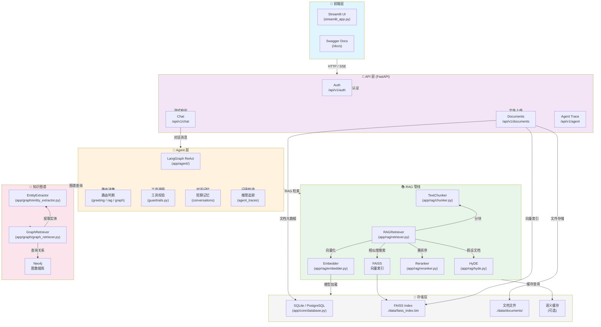

# MemBrain - 个人知识助手

基于 **LangGraph + RAG + 知识图谱** 的智能 Agent，支持对话、文档管理和多源检索。

## 架构总览



## 功能特性

| 特性 | 说明 |
|------|------|
| **RAG 问答** | 基于文档检索 + LLM 生成，支持中文 embedding |
| **知识图谱** | Neo4j 存储实体关系，图结构辅助推理 |
| **ReAct Agent** | LangGraph 驱动的推理-行动循环，动态选择知识源 |
| **文档管理** | 上传 txt/md/pdf → 自动分块 → 向量化 → 检索 |
| **检索增强** | Reranker 重排序 + HyDE 假设文档检索 |
| **流式对话** | SSE 实时输出，可见 ReAct 推理过程 |
| **前端界面** | Streamlit 可视化聊天 + 文档管理 |
| **推理追踪** | 每一步 Agent 决策都记录，便于调试和展示 |

## 技术栈

- **框架**: FastAPI + LangGraph + Streamlit
- **检索**: FAISS + Sentence-Transformers + Reranker
- **图谱**: Neo4j + 实体关系提取
- **AI**: DeepSeek Chat API + Function Calling
- **存储**: SQLAlchemy (SQLite/PostgreSQL) + Redis 缓存
- **测试**: pytest + pytest-asyncio (30+ tests)

## 快速启动

```bash
pip install -r requirements.txt
cp .env.example .env  # 填入你的 API Key
uvicorn app.main:app --reload --port 8000

# 另一个终端启动前端（可选）
streamlit run streamlit_app.py
```

## 请求示例

```bash
# 注册
curl -X POST http://localhost:8000/api/v1/auth/register \
  -H "Content-Type: application/json" \
  -d '{"email":"test@example.com","username":"test","password":"123456"}'

# 登录
curl -X POST http://localhost:8000/api/v1/auth/token \
  -H "Content-Type: application/json" \
  -d '{"email":"test@example.com","password":"123456"}'

# 聊天
curl -N -X POST http://localhost:8000/api/v1/chat \
  -H "Content-Type: application/json" \
  -H "Authorization: Bearer <token>" \
  -d '{"messages":[{"role":"user","content":"你好"}],"conversation_id":null}'
```
